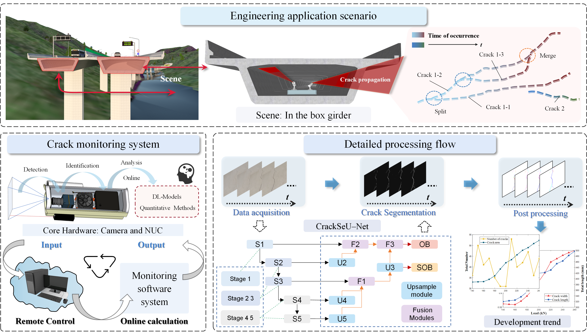
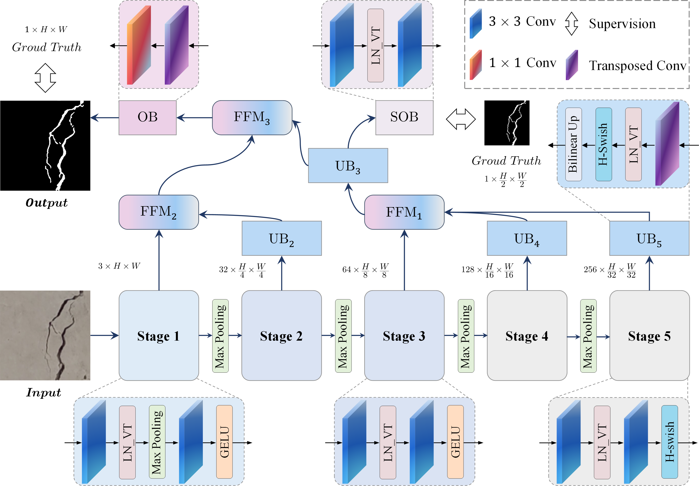
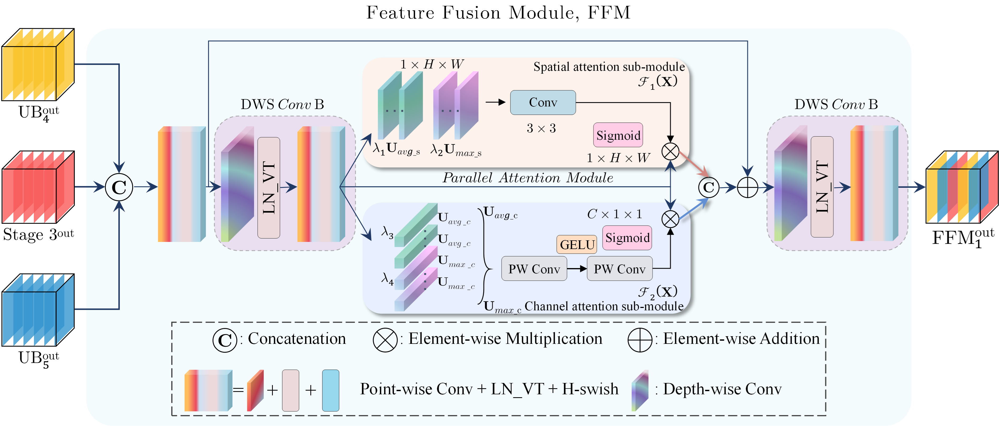

# CrackSeU
This repository is the official implementation of the **Crack** **Se**gmentation **U**-shape (**CrackSeU**) Network.

### 🔥 Break News:  
Our paper is finally accepted by Automation in Construction after a year of review. I have to say it has been a long and tough journey. 😭.

The paper is available:  
[Online monitoring of crack dynamic development using attention-based deep networks](https://www.sciencedirect.com/science/article/pii/S0926580523002820), Automation in Construction, 154 (2023) 105022, by Wang chen*, [Zhili He](http://zl-he.com/)*, and Jian Zhang#. ( *: Co-first authors, #: Corresponding Author )



## 🛴 Getting Started
### 1. Requirement
~~~
Recommended versions are
    * python = 3.5
    * pytorch = 1.12.1
    * CUDA 11.6.2 and CUDNN 8.6.0  
Other requirements can be found in the Requirements.txt.
~~~

### 2. Installation
```bash
git clone https://github.com/hzlbbfrog/CrackSeU
cd CrackSeU
pip install -r Requirements.txt
```
Or, you can directly "Download ZIP".

### 3. Build your own dataset
You can refer to the following file tree to organize your own data.
```
Your project
│   README.md
│   ...
│   CrackSeU_main.py
│
└───Dataset
    |
    └───Your dataset name
        |
        └───Train
            └───images
            └───masks
        └───Test
            └───images
            └───masks
│  
└───...Other directories   
```

### 4. Training
- [x] Include CrackSeU-B with LN_VT.
- [x] Include CrackSeU-B with BN.
- [x] Include CrackSeU-B with LN_Pytorch.
- [x] Include CrackSeU-B with LN_He.

To train the CrackSeU-B with LN_VT, simply run:
```shell
python CrackSeU_main.py --action=train --arch=CrackSeU_B_LN_VT --epoch=50 --batch_size=2 --lr=1e-4
```

### 5. Test
To test the CrackSeU-B with LN_VT, simply run:
```shell
python CrackSeU_main.py --action=test --arch=CrackSeU_B_LN_VT --test_epoch=50
```

## 🎯 Method
### :rocket: The network architecture of CrackSeU:


### :rocket: Illustration of the proposed FFM:



## :medal_military: Results
### Performance comparison of different methods on Concretecrack
| **Method**                 | **m IoU (%)**  | **mi IoU (%)** | **mi Dice (%)** | **#Param. (M)** |**MACs (G)** |
|:---------------------------|:--------------:|:--------------:|:---------------:|:---------------:|:-----------:|
| **U-Net**                  | 81.04         | 75.35          | 81.20          | 7.77            | 55.01       |
| **U-Net (large)**          | 82.65         | 76.18          | 81.40           | 31.04           | 219.01       |
| **U-Net++**                | 79.51          | 74.02          | 80.14           | 9.16            | 138.63      |
| **U-Net++ (large)**        | 80.33          | 74.50         | 81.03           | 36.63            | 552.67      |
| **Attention U-Net**        | 82.87         | 75.85          | 81.17          | 34.88           | 266.54      |
| **CE-Net**                 | 81.28          | 75.25          | 81.09          | 29.00           | 35.60       |
| **CrackSeU-B**             | **85.74**          | **81.32**          | **88.55**           | **3.19**            | **11.22**       |
| **CrackSeU-M**             | **85.85**         | **81.53**         | **88.66**           | **3.58**            | **15.04**       |   
| **CrackSeU-L**             | **86.39**         | **82.09**         | **89.11**           | **4.62**            | **28.22**       |

It is worth noting that the number of parameters of **CrackSeU-L** is **4.62M**.   
In the original paper, we mistakenly considered the parameters of the SOB so that the data is **4.70M** and a little higher than the true **#Param. (4.62M)**.   
We are really sorry if this makes you confused. 

### Quantitative evaluation of different models on Deepcrack
| **Method**                 | **m IoU (%)**  | **mi IoU (%)** | **mi Dice (%)** | **F1 score** | **#Param. (M)** |**MACs (G)** |
|:---------------------------|:--------------:|:--------------:|:---------------:|:------------:|:---------------:|:-----------:|
| **U-Net**                  | 69.41         | 68.17          | 75.07          | 78.16          |7.77            | 43.84       |
| **U-Net (large)**          | 69.61         | 68.40          | 75.64           | 78.41          |31.04           | 174.53       |
| **U-Net++**                | 70.19          | 67.92          | 74.91           | 78.20          |9.16            | 110.47      |
| **Attention U-Net**        | 71.48         | 69.19          | 75.11          | 79.16          |34.88           | 212.40      |
| **CE-Net**                 | 69.24          | 68.80          | 76.10          | 79.30         |29.00           | 28.37       |
| **DeepLabv3+ (MobileNetv2)**   | 69.70          | 69.18          | 74.23          | 78.34          |5.81           | 23.25       |
| **DeepLabv3+ (ResNet-101)**     | 70.15         | 67.52          | 73.82          | 78.38          |59.34           | 70.80       |
| **CrackSeU-B**             | **73.80**          | **71.71**          | **81.40**          |**81.82**           | **3.19**            | **8.94**       |

**Correction in 2024/12/24**  
we find a difference between the above results and the table in [the original paper](https://www.sciencedirect.com/science/article/pii/S0926580523002820). This mistake is because when we do the table of Deepcrack, we first  copy the table of Concretecrack and then change the values. We missed changing the value (belonging to Concretecrack) to the new one (Deepcrack). We have corrected it.

## 💘 Citing CrackSeU
You are very welcome to cite our paper! The BibTeX entry is as follows:

```BibTeX
@article{CrackSeU,
title = {Online monitoring of crack dynamic development using attention-based deep networks},
journal = {Automation in Construction},
volume = {154},
pages = {105022},
year = {2023},
doi = {https://doi.org/10.1016/j.autcon.2023.105022},
url = {https://www.sciencedirect.com/science/article/pii/S0926580523002820},
author = {Wang Chen and Zhili He and Jian Zhang},
keywords = {Crack identification, Online monitoring method, Deep learning}
}
```

## 👅 Acknowledgements
SEU is also the abbreviation of [Southesast Univertisy](https://www.seu.edu.cn/).  
The name of our framework ( Crack[**SeU**](https://www.seu.edu.cn/)) is also dedicated to the 120th anniversary of Southeast University.

